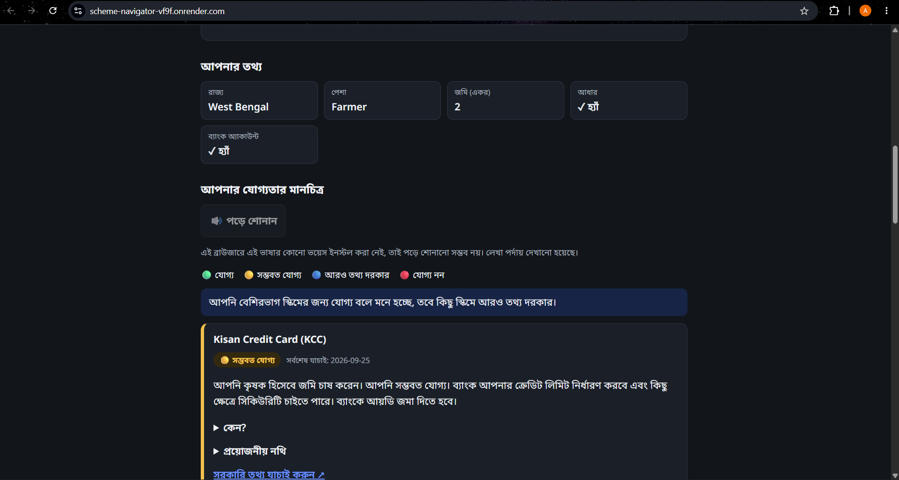
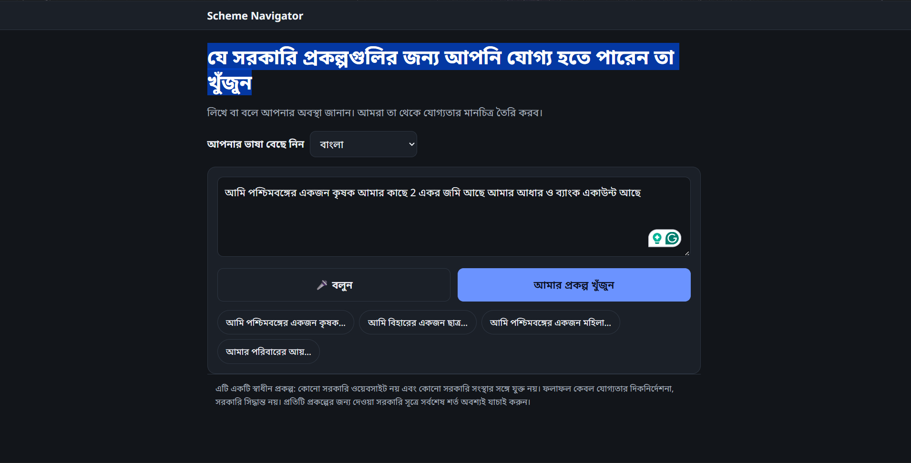
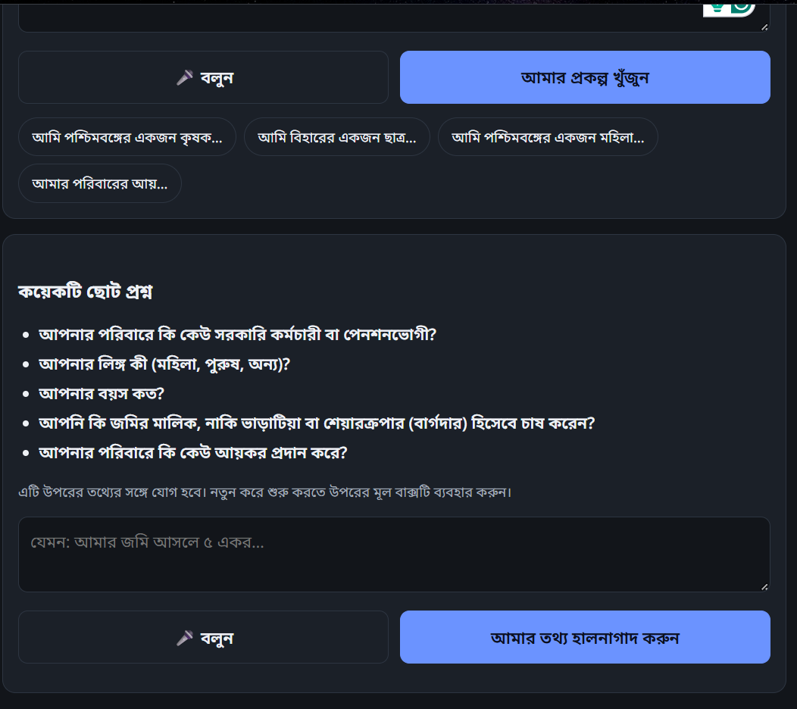

<div align="center">

# 🧭 Scheme Navigator

### Find the Indian government schemes you may qualify for, in your own language.

Type or speak your situation in **11 Indian languages** and get an **eligibility map**, a **document checklist**
and **links to the official sources**. Eligibility is decided by **auditable code, not by AI**.


### 🔗 **[Try the live demo →](https://scheme-navigator-vf9f.onrender.com)**

<!-- TODO(Ambar): record a ~30s GIF: speak in Bengali → follow-up question → results
     Then uncomment the line below.

-->

<sub>Hosted on Render's free tier: the first load after a quiet period can take about a minute to wake up.</sub>



</div>

> ⚠️ **Independent project. Not a government website.** Results are eligibility *guidance*, not an official
> determination. Always verify current requirements on the official source linked for each scheme.

---

## ✨ What it does

> *"I am a farmer from West Bengal. I have 2 acres of land."*

| Step | What happens |
|---|---|
| 1. **You say it** | Type or use the 🎤 button, in English, हिन्दी, বাংলা, मराठी, తెలుగు, தமிழ், ગુજરાતી, اردو, ಕನ್ನಡ, ଓଡ଼ିଆ or മലയാളം |
| 2. **AI reads it** | Your words become a structured profile: `state = West Bengal`, `occupation = farmer`, `land = 2 acres` |
| 3. **Code decides** | A deterministic rules engine checks every scheme. The AI has no say in eligibility |
| 4. **You get a map** | Each scheme is 🟢 Eligible, 🟡 Likely, 🔵 Needs more info, or 🔴 Not eligible, with the *reasons* |
| 5. **You get a checklist** | Documents merged across schemes (Aadhaar appears once, with a ✓ if you said you have it) |
| 6. **You verify** | One click to the official source, with a "last verified" date on every scheme |

### 📸 Screenshots (shown in Bengali)

| 1. Speak or type in your language | 2. It asks only what it needs |
|---|---|
|  |  |

The results screen is at the top of this page: your extracted profile, then one card per scheme with the reasons,
the documents needed, and a link to the official source.

Notice what it does **not** do: "I have 2 acres" does **not** mean "I own 2 acres". Ownership stays *unknown*
and the app asks a follow-up question instead of guessing (see [Safety by design](#-safety-by-design)).

---

## 🧠 How it works

```
   your words (text / voice, any of 11 languages)
            │
            ▼
   ┌──────────────────┐    only extracts facts you actually stated
   │  LLM  (Groq /    │──▶ strict schema validation, bad fields dropped,
   │  Anthropic)      │    ownership claims must be backed by your own words
   └──────────────────┘
            │  structured profile
            ▼
   ┌──────────────────┐    machine-readable rules per scheme (YAML)
   │ Rules engine     │──▶ ELIGIBLE · LIKELY · MISSING INFO · NOT ELIGIBLE
   │ (pure Python)    │    + follow-up questions + de-duplicated documents
   └──────────────────┘
            │  results (the source of truth)
            ▼
   ┌──────────────────┐    rewords results in your language;
   │  LLM  (explain)  │──▶ cannot change a status, add a scheme or invent a document
   └──────────────────┘
            ▼
   eligibility map + checklist + official links
```

| Task | Done by |
|---|---|
| Understanding your words, translating, plain-language wording | LLM (output validated) |
| **Eligibility status, matched rules, documents, follow-up questions** | **Deterministic Python** (`backend/eligibility_engine.py`) |

---

## 🧩 Product decisions

### Problem & user

<!-- TODO(Ambar): confirm or rewrite this wording. -->
Small farmers and their families in West Bengal who don't know which government schemes they qualify for. They
are often more comfortable speaking than typing, and often not in English.

### Key trade-offs

| Decision | Why |
|---|---|
| **The AI extracts, code decides** | Every status can be traced to a readable YAML rule, and the model can't make up eligibility. |
| **Unknown is never treated as yes or no** | A wrong "eligible" or "not eligible" costs the user more than one follow-up question. |
| **PM-JAY left out** | Its eligibility depends on SECC 2011 data that this profile cannot express. |
| **6 schemes: depth over breadth** | West Bengal plus national farmer schemes, each with sourced rules, documents and follow-up questions. |
| **Stateless, no database** | Privacy (the server stores nothing) and a simple deploy as one Render web service. |
| **Voice-first, 11 languages** | Users can speak in their own language rather than type in English. |

### What I learned from users

<!-- TODO(Ambar): fill in from real user conversations. Leave empty rows out rather than guessing. -->
| Who | What confused them | What I changed |
|---|---|---|
| TODO(Ambar) | TODO(Ambar) | TODO(Ambar) |

### What I'd measure if this launched

These are planned metrics, not results. The app does not collect any of them today.

- **Completion rate**: share of sessions that go from input to results.
- **Follow-up rate**: share of sessions that need at least one follow-up question.
- **Click-through to official sources**: share of results where the user opens the official link.
- **Drop-off by language**: where sessions are abandoned, split by the selected language.
- **"Needs more info" share**: share of scheme results that end as *Needs more info*.

---

## 🚀 Features

- 🗣️ **Voice-first, multilingual**: speech input and read-aloud in the selected language; switching language
  starts a clean new interaction (no API call, nothing carried over).
- ✅ **Explainable results**: every card shows *why* (rules met / not met / missing) and what to confirm.
- 📋 **Smart document checklist**: merged across schemes, deduplicated, ticked from what you told us.
- 🛡️ **Won't over-claim**: unknown is never treated as yes or no; ambiguous statements stay unknown.
- 🔌 **Swappable AI**: Groq (free tier friendly) or Anthropic behind one small interface.
- 🧯 **Failures are honest**: every AI failure has a code and a friendly message; English falls back to a
  basic offline reader, other languages never guess.
- 🌐 **One service to deploy**: FastAPI serves the API *and* the frontend. No database, no disk, no CORS.
- 🚦 **Public-demo safe**: input caps, per-IP rate limit, graceful Groq rate-limit handling, key never leaves the server.

---

## 📚 Schemes covered

Defined in [`backend/schemes/`](backend/schemes) as YAML with `official_url`, `last_verified` and
`verification_notes` (exactly what was read from where).

| Scheme | Level | Verification |
|---|---|---|
| PM-KISAN | India | ✅ Official |
| PMFBY (crop insurance) | India | ⚠️ Secondary |
| Kisan Credit Card | India | ⚠️ Secondary |
| Krishak Bandhu | West Bengal | ⚠️ Secondary |
| Swasthya Sathi | West Bengal | ⚠️ Secondary |
| Lakshmir Bhandar | West Bengal | ✅ Official |

> ✅ **Official**: the rules were read from an official government page (for Lakshmir Bhandar, a West Bengal
> district government page). ⚠️ **Secondary**: the rules come from secondary sources and **must be verified
> against official guidelines before real use.** Each YAML file's `verification_notes` starts with this status
> and says exactly what was read from where. Benefit amounts are deliberately not stored.
> PM-JAY is intentionally left out: its eligibility depends on SECC 2011 data this profile cannot express.

---

## 🏁 Quick start (local)

```bash
git clone https://github.com/AAAaMMbbaarr/scheme-navigator.git
cd scheme-navigator

pip install -r requirements-dev.txt      # runtime + pytest
cp .env.example .env                     # Windows: copy .env.example .env  → then add your key
python -m uvicorn backend.main:app --reload
```

Open **http://127.0.0.1:8000** (voice input works best in Chrome or Edge).
No API key? English still works with a basic offline reader; other languages need the AI.

> 🔁 `.env` is read **once at startup**. Restart the server after editing it or pulling changes.

### Choose your AI provider

| `LLM_PROVIDER` | Needs | Notes |
|---|---|---|
| `groq` | `GROQ_API_KEY` | OpenAI-compatible API, default model `openai/gpt-oss-20b` |
| `anthropic` (default if unset) | `ANTHROPIC_API_KEY` | model from `CLAUDE_MODEL` |

Keys come from the environment or `.env` only, and are never logged or returned by the API.
See [`.env.example`](.env.example) for every option.

---

## ☁️ Deploy on Render (single web service)

| Setting | Value |
|---|---|
| Build command | `pip install -r requirements.txt` |
| Start command | `uvicorn backend.main:app --host 0.0.0.0 --port $PORT` |
| Health check path | `/health` |
| Python | 3.12.4 |

Set these in the Render dashboard (they are also listed in [`render.yaml`](render.yaml)):

| Variable | Value |
|---|---|
| `LLM_PROVIDER` | `groq` |
| `LLM_BASE_URL` | `https://api.groq.com/openai/v1` |
| `LLM_MODEL` | `openai/gpt-oss-20b` |
| `GROQ_API_KEY` | 🔒 **secret**, enter it in the dashboard only, never commit it |
| `RATE_LIMIT_PER_MINUTE` | optional, default `20` analyses per client IP (`0` = off) |

Free instances sleep when idle, so the first request after a pause can take about a minute.
Free-tier Groq limits can also apply under load; users then see a friendly "busy" message.

---

## 🛡️ Safety by design

- **The AI never decides eligibility.** Only the rules engine does, and every rule is readable YAML.
- **No invented ownership.** "I have / मेरे पास / আমার … আছে" leaves land ownership *unknown*. It is set only when
  your own words say so ("I own", "मालिक", "আমার নামে", "rented", "बटाई"...), the model must quote them, and code
  verifies the quote is real, matches, and isn't negated. Code also checks the quote in its own sentence:
  "in my name / আমার নামে" counts only next to a land word, and "owner / मालिक" only when it is about you. So
  "My name is Ramesh…", "मेरा नाम है…" and "I work on the owner's farm" stay *unknown*, and you are asked.
- **Fresh by default.** Each new statement is a new profile. The only way to build on an earlier one is the
  explicit "Add or correct your details" box. The server stores nothing.
- **Nothing is submitted anywhere.** No government portal automation, no CAPTCHA/OTP handling.
- **Secrets stay server-side.** The browser never receives keys or provider configuration.

---

## 🧪 Tests

```bash
python -m pytest              # backend + API + safeguards (also runs the frontend tests if Node is installed)
npm install && npm test       # frontend tests (jsdom): language switching, voice, error messages
```

Covers the eligibility engine, multilingual extraction, the ownership safeguard, provider failures (including
rate limits), secret handling, deployment configuration, and the language-switch reset behaviour.
The AI is always mocked in tests: no network, no real keys.

---

## 🗂️ Project structure

```
backend/
  main.py                FastAPI app, /health, rate limit, static frontend
  eligibility_engine.py  deterministic rules engine (no AI imports)
  profile_extractor.py   text → validated profile (conservative extraction)
  ownership.py           guard against invented land-ownership claims
  explainer.py           localized explanations (cannot alter results)
  llm.py                 Groq / Anthropic behind one interface + error codes
  ratelimit.py           tiny in-memory per-client limiter
  languages.py           the 11 supported languages and speech locales
  schemes/*.yaml         scheme rules, documents, official links
frontend/                static UI (HTML, JS, CSS), no build step
tests/                   pytest + Node tests
render.yaml              Render blueprint
```

---

## ⚠️ Known limitations

- A hackathon/demo MVP with **6 schemes**, not a complete or official directory.
- Scheme rules can change; several were drawn from secondary sources (see each YAML file's notes).
- UI text is fully translated for English, हिन्दी and বাংলা; the other languages cover the core screens and
  fall back to English elsewhere. Native-speaker review is welcome.
- Browser speech quality varies: some languages have no recognition or voice installed.
- Explanations come from an LLM and can be imperfect; **the eligibility status always comes from the rules engine.**

---

## 📄 License

[MIT](LICENSE) © 2026 Ambar Banerjee

---

<div align="center">

Built to make government schemes easier to find, understand and prepare for. 🇮🇳

</div>
